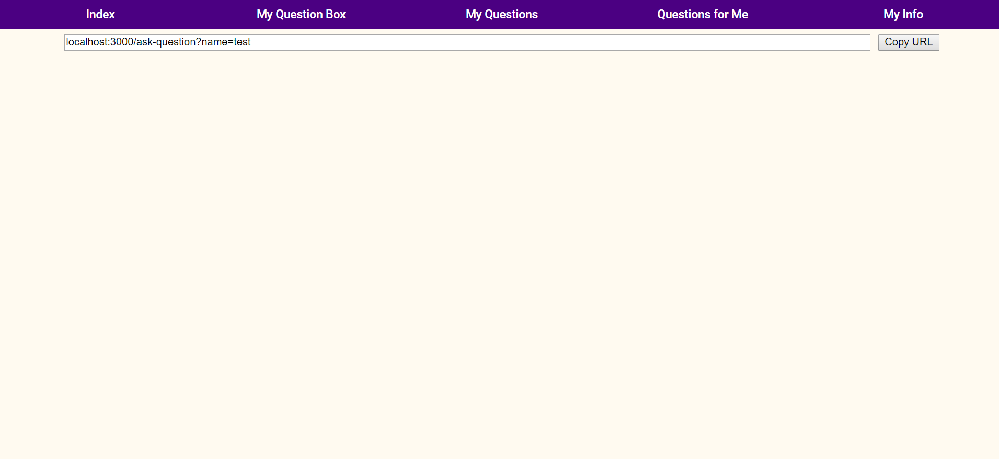

# course-project-group-13: Anonymous Question Box Web Application

Group members: Liu Yuchen, Zuo Yue, Zhang Di

[Follow this link for video introduction.](https://drive.google.com/file/d/1HmZcft58NvLQ4r43uJTV3_BC7AL56j8-/view?usp=share_link) (Download it for better quality.)

## Quick Start:

To start this web app, simply execute `docker compose up` in the root directory of the repo. Then visit `localhost:3000` in your browser.

> This app uses Google API. However, as this web app is not valdated by Google, it is in preview mode. Anyone that wants to use the API needs to send me a Google account email, then I can register you in the web app.

## 1. Summary:

Our team has developed a web-based anonymous question box application which allows registered
users to generate their own question box links and post them on social media, while other users can
anonymously ask questions. This application is designed to provide users with a secure and anonymous
platform for meaningful communication and knowledge sharing.

Google Calendar API and Google Content Moderator are introduced to enhance the user experience.
We believe that the design and functionality of this application can serve as a useful tool for facilitating
meaningful communication and fostering knowledge exchange among users.

## 2. The Original Intention of Design Inspiration:

The development of the Internet in modern society has greatly improved the convenience of people’s lives,
however, the excessively wide channels of information dissemination have also gradually increased people’s
requirements for privacy. On the vast Internet, users do not actually know the real identity of each other, so
they can talk freely without pressure. Similarly, from the corners of Internet, ”safe distance” in the society
of acquaintances is also a demand that cannot be ignored. Building a question box where others can post to
someone an anonymous question can be one of the solutions.

## 3. More Detailed Problem Statement:

The history of the Anonymous Question Box dates back to 2007. At that time, an anonymous question box
based on the Python language was created by Google engineer Kevin Lawler for question-and-answer exchanges
between students and teachers. In Google Moderator, a question asked by someone can be seen by everyone.

In recent years, smartphones have replaced computers as the new form of entertainment. According to
public data, one anonymous question box name ’Popi’ from a Chinese brand has attracted nearly 2 million fans
in two years through small programs and APPs.

In this project, we will build a social web application, users can generate their own question box and copy
the link to paste on their usual social platforms and invite others to ask questions.

Among the two parties in the interaction, only the identity of the questioner is hidden. After they ask a
question, the person who initiated the question box needs to answer with their public accounts. The respondent
is not anonymous, and his or her responses become part of his or her online self-presentation.

The question box is like a fishing net, the moment you let it out, you start to look forward to what will come
out of the net. People can vent their emotions, release their secrets, and feel care from ”strangers” here. A lot of
things can’t be said in front of acquaintances, but once they are anonymous, everything will be different. You
don’t know who the other person is. This is the biggest ”curiosity” of the anonymous question box. The person
may be a friend you haven’t contacted for a long time, or it may be a stranger. It will make you feel amazing to
communicate and connect through a box.

## 4. Realization of the Question Box:

### 4.1 Implementation of basic functions:

The fundamental functionality of this web application is to enable registered users to create their own
question box for others to post questions. When a person clicks to enter the interface, the system will ask this
person to register. After entering basic information such as unique username, nickname, and password, backend
of the system will perform verification and processing, then generate a token as a credential for user login
information. When users apply to visit a protected page, token needs to be provided to verify their identity.
Sign-up and log-in UI is shown as follows:

Figure 1: Sign-up and log-in UI

After passing the necessary registration steps, the user can enter the main page, which is a brief introduction
to the web app. Click the navigation bar above to switch, and the second one is user’s own question box. The
URL is automatically generated based on the username (previously mentioned that the username is unique when
registering). As long as user click copy URL, his/her question box link can be copied quickly to clipboard.

Figure 2: Welcome page

Figure 3: Generate question box

At this time, the box is inaccessible to anyone except the user themselves. Upon generating the box, a
unique URL containing the user’s username is created, which can be shared on public social media platforms
to allow friends and acquaintances to access the user’s exclusive question box. Once accessed and registered,
other users can open the question box, enter the question and submit it anonymously, initiating a two-way
conversation. This constitutes the core feature of the web application.

Each question box owner’s webpage only displays their name and a text box. Visitors can submit questions,
which are only visible to the owner and the questioner until the owner responds. Once the owner answers a
question, the question and its answer are posted publicly on the owner’s webpage, allowing other visitors to
view the entire conversation thread. However, the names and nicknames of visitors other than the box host are
not displayed publicly. This ensures privacy and confidentiality for visitors involved. Also, a delete function for
questions is already included.

Figure 4: Receive a question

### 4.2 Implementation of quick and easy answer with Google Calendar API

In addition to the basic implementation of the web app, we have added a function that can quickly and easily
answer repeated questions. Once registered, users can fill in their basic information on the self-info interface,
which includes fields such as hobbies, birthday, and regions. This information is then stored in the database and
can be modified by the user at any time. When a user receives a question that matches the information they have
provided, they can easily select the answer from the database and paste it onto the answer page. This feature
eliminates the need for users to repeatedly enter the same information, making the process more convenient
and efficient. Overall, this functionality enhances the user experience and streamlines the question-answering
process.

Figure 5: Choose to answer easily

Basic information are stored in database. To enhance the functionality of our system, we have integrated the
Google Calendar API, which enables us to retrieve the current user’s schedule. This API has been leveraged to
augment the existing database with real-time scheduling data, thus providing users with a more comprehensive
and personalized experience. By leveraging this API, our system is able to seamlessly access and retrieve
important scheduling information, making it an invaluable addition to our platform.
Note that as the Web APP status is ”testing”, anyone who wants to use the API needs to be registered
manually by us developers, otherwise you won’t be able to try this API.

Figure 6: Answer is generated

Figure 7: Conversation becomes public

### 4.3 Implementation of hazardous contents filter:

We realize that an anonymous question box, if abused, can lead to malicious usage. To reduce the chance
of abuse, we integrated a malicious content filter API to check the content of questions and answers.
We chose [Microsoft Content Moderator](https://learn.microsoft.com/en-us/azure/cognitive-services/content-moderator/) for this purpose. This API is NLP-based, and RESTful. Whenever
a user tries to post a question or an answer, the back-end server will use the API to detect possible offensive
content. If it does, the request will be rejected.

Figure 8: when you reply rude word to others, it will be forbidden.

## 5 Possibility of Project to be Open-sourced

When considering the possibility of open-sourcing a project, several factors need to be taken into account.
In our case, we can evaluate the potential benefits of open-sourcing our project. For example, it could enable
the community to contribute to the development and enhancement of the system, potentially leading to faster
progress and improved functionality. An open-sourced software might also give the public more confidence on
the anonymity of the application.

We used a MERN tech stack for this application. The different pages are routed via a React Router. We also
used Google Cloud API and Microsoft Azure API to implement calendar and moderator feature, respectively.
The repository is containerized via Docker compose.

## 6 Competition Analysis

Our project possesses a significant advantage over similar competitors due to its ability to efficiently and
conveniently provide answers to questions that match a user’s profile information. This unique feature greatly
reduces the time and effort required for users to respond to questions, as well as alleviates the anxiety associated
with repeatedly answering similar questions. As a result, our system can help to mitigate user fatigue and
enhance their overall experience, ultimately leading to increased engagement and retention.

The integration of the Google Calendar API into our system has facilitated the efficient and convenient provision of answers to questions related to a user’s schedule, beyond their basic personal information. This
feature enables users to receive real-time updates on their schedule and quickly check relevant information,
thereby enhancing the accuracy and fun of the responses.

Figure 8: Choose to get schedule

Figure 9: Invoke Google calendar API

Moreover, our system’s incorporation of a malicious language filter provides users with a safer and more
comfortable environment by minimizing the risk of encountering abusive or inappropriate content. This feature
not only promotes a positive user experience but also aligns with ethical considerations surrounding user safety
and well-being in online communities.

In summary, our system’s integration of the Google Calendar API and the inclusion of a malicious language
filter represent significant advancements in providing efficient and safe question-answering experiences for users.

## 6 Looking Forward

In addition to the currently implemented features, we still have a long way to go. For example, the protection
of user data privacy can be reinforced to ensure that user privacy is not compromised. Additional interactive
and social elements can be incorporated to facilitate the establishment of social relationships among users.

Furthermore, anonymous question-and-answer systems can find applications in various domains, such as
mental health, where users can anonymously seek advice and support on mental health-related issues; education,
where students can anonymously ask questions to their teachers to address their doubts; and the workplace,
where employees can anonymously ask questions to the management and provide their opinions and suggestions.

Figure 10: Answer is generated

Figure 11: Posting insulting information will be rejected
